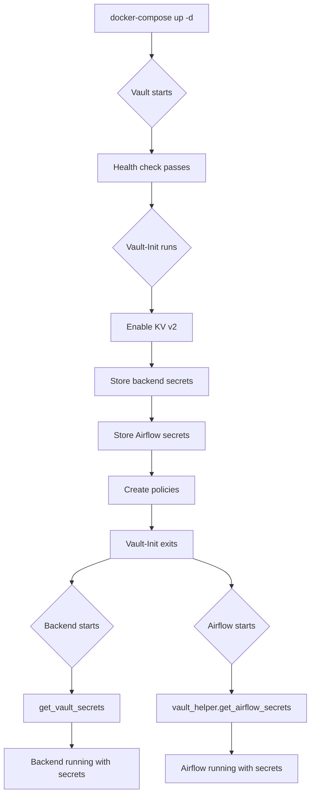

# Vault Integration Architecture

## System Architecture Diagram

```
┌─────────────────────────────────────────────────────────────────┐
│                     Docker Compose Network                       │
│                                                                  │
│  ┌──────────────┐         ┌──────────────┐                     │
│  │   Vault      │         │  Vault-Init  │                     │
│  │  (Dev Mode)  │◄────────│  (One-time)  │                     │
│  │  Port: 8200  │         │              │                     │
│  └──────┬───────┘         └──────────────┘                     │
│         │                                                        │
│         │ Stores Secrets in KV v2                              │
│         │ ┌────────────────────────────────────┐              │
│         │ │ secret/backend/                    │              │
│         │ │  ├─ postgres_user                  │              │
│         │ │  ├─ postgres_password               │              │
│         │ │  ├─ postgres_db                     │              │
│         │ │  ├─ minio_access_key                │              │
│         │ │  ├─ minio_secret_key                │              │
│         │ │  └─ jwt_algorithm                   │              │
│         │ │                                      │              │
│         │ │ secret/airflow/                     │              │
│         │ │  ├─ postgres_user                   │              │
│         │ │  ├─ postgres_password               │              │
│         │ │  ├─ postgres_db                     │              │
│         │ │  ├─ fernet_key                      │              │
│         │ │  ├─ webserver_secret_key            │              │
│         │ │  ├─ minio_access_key                │              │
│         │ │  └─ minio_secret_key                │              │
│         │ └────────────────────────────────────┘              │
│         │                                                        │
│    ┌────┴──────────────────────────┐                           │
│    │                                │                           │
│    ▼                                ▼                           │
│  ┌──────────────┐           ┌──────────────┐                  │
│  │   Backend    │           │   Airflow    │                  │
│  │   Service    │           │   Services   │                  │
│  │              │           │              │                  │
│  │ ┌──────────┐ │           │ ┌──────────┐ │                  │
│  │ │get_vault_│ │           │ │ vault_   │ │                  │
│  │ │secrets() │ │           │ │ helper.py│ │                  │
│  │ └──────────┘ │           │ └──────────┘ │                  │
│  │              │           │              │                  │
│  │ Retrieves:   │           │ Retrieves:   │                  │
│  │ • DB creds   │           │ • DB creds   │                  │
│  │ • MinIO keys │           │ • Fernet key │                  │
│  │ • JWT config │           │ • MinIO keys │                  │
│  └──────────────┘           └──────────────┘                  │
│         │                           │                           │
│         └───────────┬───────────────┘                          │
│                     │                                           │
│                     ▼                                           │
│         ┌───────────────────────┐                              │
│         │  Infrastructure       │                              │
│         │  Services             │                              │
│         │  ┌─────────────────┐  │                              │
│         │  │ PostgreSQL      │  │                              │
│         │  │ MinIO           │  │                              │
│         │  │ MLflow          │  │                              │
│         │  └─────────────────┘  │                              │
│         └───────────────────────┘                              │
│                                                                  │
└─────────────────────────────────────────────────────────────────┘
```

## Secret Flow

### Startup Sequence

```
1. docker-compose up -d
   │
   ├─► Vault starts (dev mode)
   │   └─► Health check passes
   │
   ├─► Vault-Init runs
   │   ├─► Enables KV v2 engine
   │   ├─► Creates secrets
   │   └─► Creates policies
   │
   ├─► Backend starts
   │   ├─► get_vault_secrets() called
   │   ├─► Connects to Vault (retry logic)
   │   ├─► Reads secret/backend
   │   └─► Starts application with secrets
   │
   └─► Airflow services start
       ├─► vault_helper module imported
       ├─► get_airflow_secrets() called
       ├─► Connects to Vault (cached)
       ├─► Reads secret/airflow
       └─► Starts services with secrets
```

### Request Flow (Backend Example)

```
User Request → Backend Service
                    │
                    ├─► Needs to connect to PostgreSQL
                    │   └─► Uses POSTGRES_PASSWORD from Vault
                    │
                    ├─► Needs to connect to MinIO
                    │   └─► Uses MINIO_ACCESS_KEY from Vault
                    │
                    └─► Needs to sign JWT
                        └─► Uses JWT_ALGORITHM from Vault
```

## Access Control

```
┌─────────────────────────────────────────────────────────┐
│                    Vault Policies                        │
│                                                          │
│  ┌──────────────────────────────────────────┐          │
│  │ backend-policy                            │          │
│  │                                            │          │
│  │ path "secret/data/backend" {              │          │
│  │   capabilities = ["read"]                 │          │
│  │ }                                          │          │
│  │                                            │          │
│  │ • Backend service can ONLY read           │          │
│  │   secret/backend                          │          │
│  │ • Cannot access secret/airflow            │          │
│  └──────────────────────────────────────────┘          │
│                                                          │
│  ┌──────────────────────────────────────────┐          │
│  │ airflow-policy                            │          │
│  │                                            │          │
│  │ path "secret/data/airflow" {              │          │
│  │   capabilities = ["read"]                 │          │
│  │ }                                          │          │
│  │                                            │          │
│  │ • Airflow services can ONLY read          │          │
│  │   secret/airflow                          │          │
│  │ • Cannot access secret/backend            │          │
│  └──────────────────────────────────────────┘          │
└─────────────────────────────────────────────────────────┘
```

## Components

### Vault Service
- **Type**: HashiCorp Vault
- **Mode**: Development (in-memory storage)
- **Port**: 8200
- **Token**: root
- **Health Check**: `vault status`
- **Purpose**: Centralized secrets management

### Vault-Init Service
- **Type**: One-time initialization container
- **Runs**: Once at startup
- **Actions**:
  1. Enable KV v2 secrets engine
  2. Store backend secrets
  3. Store Airflow secrets
  4. Create backend-policy
  5. Create airflow-policy
- **Exit**: After successful initialization

### Backend Service
- **Language**: Python (FastAPI)
- **Vault Client**: hvac 1.1.1
- **Integration**: `get_vault_secrets()` in main.py
- **Retry Logic**: 5 attempts, 2s delay
- **Environment Variables**:
  - VAULT_ADDR=http://vault:8200
  - VAULT_TOKEN=root

### Airflow Services
- **Components**: webserver, scheduler, worker, flower
- **Vault Client**: hvac (via vault_helper)
- **Integration**: `vault_helper.py` module
- **Features**:
  - Singleton client connection
  - Secret caching
  - Retry logic
  - Pre-loading at import

## Security Layers

```
┌─────────────────────────────────────────────────────────┐
│ Layer 1: Network Isolation                              │
│ • All services in Docker network                        │
│ • Vault not exposed externally (except dev port 8200)  │
└─────────────────────────────────────────────────────────┘
                          │
                          ▼
┌─────────────────────────────────────────────────────────┐
│ Layer 2: Authentication                                  │
│ • Token-based auth (root token in dev mode)            │
│ • Services must provide valid token                     │
└─────────────────────────────────────────────────────────┘
                          │
                          ▼
┌─────────────────────────────────────────────────────────┐
│ Layer 3: Authorization (Policies)                       │
│ • backend-policy: read secret/backend only              │
│ • airflow-policy: read secret/airflow only              │
│ • Least-privilege access                                │
└─────────────────────────────────────────────────────────┘
                          │
                          ▼
┌─────────────────────────────────────────────────────────┐
│ Layer 4: Secret Versioning                              │
│ • KV v2 engine maintains version history                │
│ • Can rollback to previous versions                     │
│ • Audit trail of changes                                │
└─────────────────────────────────────────────────────────┘
                          │
                          ▼
┌─────────────────────────────────────────────────────────┐
│ Layer 5: Memory Protection (IPC_LOCK)                   │
│ • Prevents memory from being swapped to disk            │
│ • Secrets stay in RAM only                              │
└─────────────────────────────────────────────────────────┘
```

## Deployment Flow



## File Organization

```
kyda/
├── docker-compose.yml
│   └── Vault service definitions
│
├── scripts/
│   ├── vault_health_check.py      # Quick health check
│   ├── test_vault_integration.py  # Full test suite
│   └── setup_vault.bat            # Automated setup
│
├── services/
│   └── backend/
│       ├── main.py                # get_vault_secrets()
│       └── requirements.txt       # hvac==1.1.1
│
├── airflow/
│   └── dags/
│       ├── vault_helper.py        # Shared Vault module
│       └── train_fraud_detector.py # Updated to use vault_helper
│
└── docs/
    ├── VAULT_INTEGRATION.md       # Technical guide
    ├── VAULT_DEPLOYMENT.md        # Deployment guide
    └── VAULT_IMPLEMENTATION_SUMMARY.md # Status report
```

## Production vs Development

| Aspect | Development (Current) | Production (Recommended) |
|--------|----------------------|--------------------------|
| Storage | In-memory | Consul/etcd/filesystem |
| Auth | Root token | AppRole/K8s auth |
| TLS | Disabled | Required |
| Unsealing | Auto | Auto (cloud KMS) |
| Audit Log | Disabled | Enabled |
| HA | Single node | 3+ node cluster |
| Backup | None | Regular snapshots |
| Monitoring | None | Prometheus + alerts |

---

**For detailed information, see:**
- [Integration Guide](VAULT_INTEGRATION.md)
- [Deployment Guide](VAULT_DEPLOYMENT.md)
- [Implementation Summary](VAULT_IMPLEMENTATION_SUMMARY.md)
